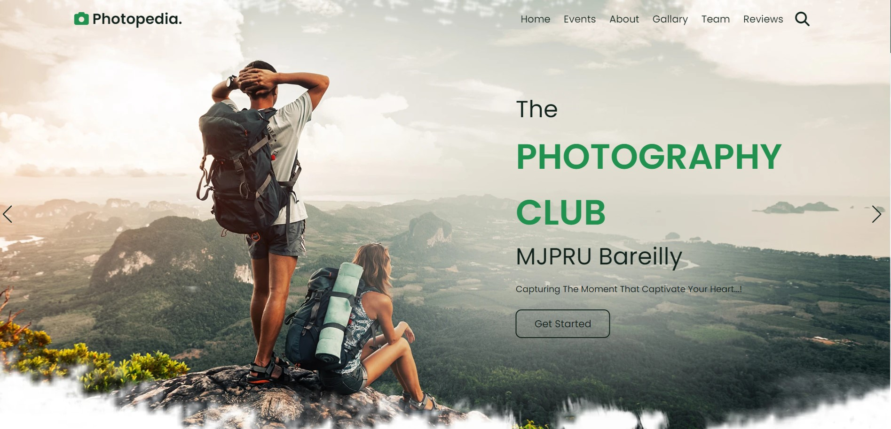

# Photopedia - Photography Club MJPRU Bareilly
The word Photography literally means ‘drawing with light’, which derives from the Greek photo, meaning light and graph, meaning to draw. Photography is the process of recording an image – a photograph – on lightsensitive film or, in the case of digital photography, via a digital electronic or magnetic memory.

The photograph is evident in nearly every aspect of modern life. As a form of communication and documentation, photographs are present in newspapers, magazines, advertisements, posters, television, the Internet, passports, ID cards, archives, security and Surveillance Systems, forensics and medicine. Photography also plays an important role in domestic and recreational activities.


## Table of contents

- [Overview](#overview)
  - [The start and main focusing](#the-start)
  - [WebImage](#webimage)
- [My process](#my-process)
  - [Built with](#built-with)
  - [What I learned](#what-i-learned)
  - [Continued development](#continued-development)
  - [Useful resources](#useful-resources)
- [Author](#author)
- [deploy](#deploy)


## Overview

### start and main focusing

- View the optimal layout for the site depending on their device's screen size
- See hover states for all interactive elements on the page

### Screenshot




## My process

### Built with

- Semantic HTML5 markup
- CSS custom properties
- javascript for swriping(home,team,reviews sections)


### What I learned

- In this project i majourly learned about different type of CSS properties flexbox and sweaping feature of javascript:

```html
<h1>Some HTML code I'm proud of</h1>
<span>Never Stop</span>
                        <h3>exploring</h3>
                        <p>Life is like a camera.
                            Just focus on what's 
                            important and capture 
                            the good times,develop
                            from the negatives,and if
                            things don't work out 
                            just take another shot.!</p>
```
```css
.proud-of-this-css {
  #zoomA {
 
  width: 100%;
  height: 100%;
  transition: transform ease-in-out 0.3s;
}
 
#zoomA:hover { transform: scale(1.2); 
  }
.team .slide {

  border: solid #10221b  ;
}
}
```
```js
const proudOfThisFunc = () => {
  window.onscroll = () =>{
    navbar.classList.remove('active');

    if(window.scrollY > 0){
        document.querySelector('.header').classList.add('active');
    }else{
        document.querySelector('.header').classList.remove('active');
    }
};
  console.log('🎉')
}
```


### Continued development
- After this project we start learnig new CSS/JS liberies and framework link Jquery , AOS , GSAP to make this site more efficient and more userfriendly , and more animeted.


### Useful resources

- [resource 1](https://developer.mozilla.org/en) - This helped me for using CSS. I really liked this pattern , and technic and will use it going forward.
- [resource 2](https://www.w3schools.com) - This is an amazing docmentation which helped me finally understand some feature in javascript. I'd recommend it to anyone still learning this concept.


## Author

- Website - [Ansh Srivastava , Komal Gangwar , Sapna Singh , Kamlesh Kumari]())
- Linkedin - [Ansh Srivastava](https://www.linkedin.com/in/ansh-srivastava-bb544b225)
- Linkedin - [Komal Gangwar](https://www.linkedin.com/in/komal-gangwar-646bb8227)
- Linkedin - [Sapna Singh](https://www.linkedin.com/in/sapna-singh-3933b9228)
- Linkedin - [Kamlesh Kumari](https://www.linkedin.com/in/kamlesh-kumari-1b4965244/)


## deploy
- [Github page]()

## Thank you
